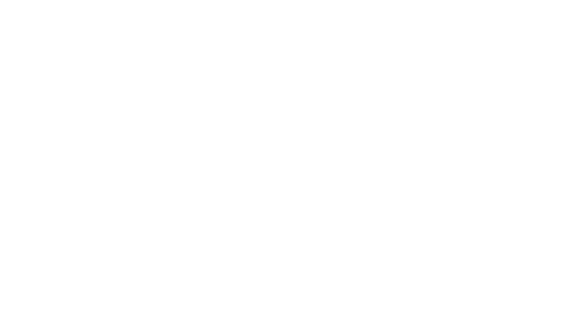

<div align="center">

</div>

[](https://www.gnu.org/software/bash/)
[](https://claude.ai/code)
[](https://cli.github.com/)
[](https://github.com/JabbaghYounes/Ricky/pulls)
[](https://github.com/JabbaghYounes/Ricky)

A drop-in AI swarm toolkit for autonomous development. Copy the `ricky/` folder into any project and go from a PRD to implemented features with pull requests.

## Quick Start

```bash
# 1. Copy ricky/ into your project
cp -r ricky/ /path/to/your-project/ricky/

# 2. Configure for your project
nvim ricky/ricky.conf

# 3. Write your PRD
nvim ricky/prd/prd.md

# 4. Run the full pipeline
ricky/scripts/run-product.sh
```

## How It Works

Ricky orchestrates specialized AI agents through a staged pipeline:

```
PRD
 → Product Manager (extract features)
 → Design Phase (architecture, DB, API, UX specs)
 → Per-Feature Swarms
    → Architect → Implementation (parallel) → Tester → Debugger (retry) → Review (optional) → PR
 → Git PR per feature
```

The design phase runs once for the whole product. Each feature then gets its own branch (`ai-feature-<timestamp>`) and pull request.

## Features

- **Agent output logging** — Every agent call is saved to `ricky/prd/logs/run-<timestamp>/` for full audit trails
- **Parallel feature swarms** — Set `MAX_PARALLEL` > 1 to build multiple features concurrently using git worktrees
- **Granular resume** — Stage-level progress tracking. If a feature fails at the test stage, resume picks up there instead of restarting
- **Cost/token tracking** — Token usage logged per agent call. Run `cost-report.sh` for a breakdown by agent, feature, and estimated cost
- **Rate-limit auto-pause** — Detects API rate limits and auto-pauses/resumes. No manual intervention needed
- **PR review agent** — Optional self-review stage catches issues before PR creation (`ENABLE_REVIEW=true`)

## Structure

```
ricky/
  ricky.conf          # Project-specific settings (test cmd, base branch, etc.)
  agents/             # Agent prompt definitions (one .md per role)
  pipelines/          # Pipeline stage documentation (YAML)
  prd/
    prd.md            # Your product requirements (edit this)
    features/         # Auto-generated feature files (one per feature)
    specs/            # Auto-generated specs (design + per-feature architecture/plan)
    status/           # Per-feature stage-level progress (resume support)
    status.json       # Summary status (backward compatible)
    logs/             # Agent output logs and cost tracking (per run)
  scripts/
    lib.sh            # Shared functions (logging, rate-limit, status tracking)
    run-product.sh    # Full pipeline: PRD → design → features → PRs
    swarm.sh          # Run a single feature swarm
    prd-extract.sh    # Extract features from PRD
    prd-swarm.sh      # Run swarm for all extracted features (sequential or parallel)
    cost-report.sh    # Generate token usage and cost report from logs
```

## Configuration

Edit `ricky/ricky.conf` to match your project:

```bash
# Command to run tests (default: npm test)
TEST_CMD="npm test"

# Base branch for feature branches (default: main)
BASE_BRANCH="main"

# Max debug retries before aborting (default: 3)
MAX_RETRIES=3

# Design agents to run (space-separated, or "none" to skip)
DESIGN_AGENTS="system-architect db-designer api-designer ux-designer"

# Implementation agents to run in parallel (default: backend frontend)
# For backend-only projects, set to "backend"
IMPL_AGENTS="backend frontend"

# Claude CLI permission mode (required for agents to use tools)
# Without this, --print mode is text-only and agents can't modify files
CLAUDE_PERMISSIONS="--dangerously-skip-permissions"

# Model for planning/design stages (cheaper, saves tokens)
DESIGN_MODEL="claude-sonnet-4-6"

# Model for implementation stages (use opus for complex projects)
IMPL_MODEL="claude-sonnet-4-6"

# Max tool-use turns per agent (limits token consumption, 0 = unlimited)
MAX_TURNS=25

# Auto-pause on rate limit, retry after this many seconds (default: 600 = 10 min)
RATE_LIMIT_WAIT=600

# Max parallel feature swarms (default: 1 = sequential)
# Higher values use git worktrees for concurrent execution
MAX_PARALLEL=1

# Enable PR review agent before commit (default: false)
ENABLE_REVIEW=false
```

## Scripts

| Script | What it does |
|---|---|
| `run-product.sh` | Full pipeline: extract features, run design phase, run all feature swarms |
| `swarm.sh "<task>"` | Single feature swarm: design → architect → build → test → debug → review → PR |
| `swarm.sh --skip-design "<task>"` | Single feature swarm without design phase (used by run-product.sh) |
| `prd-extract.sh` | Extract features from PRD into individual files |
| `prd-swarm.sh` | Run swarm for all extracted features (sequential or parallel) |
| `cost-report.sh [path]` | Generate token usage and cost report from a pipeline run |

## Agents

| Agent | Role |
|---|---|
| product-manager | Analyzes PRD, extracts feature list |
| system-architect | Designs system-level architecture from PRD |
| architect | Designs feature-level implementation and task breakdown |
| db-designer | Generates database schema |
| api-designer | Defines REST/GraphQL API spec |
| ux-designer | Defines UI flows and components |
| backend | Implements server-side logic |
| frontend | Implements UI and API integration |
| tester | Writes and runs tests |
| debugger | Fixes failing tests (up to MAX_RETRIES) |
| reviewer | Reviews diff before PR creation (optional, ENABLE_REVIEW=true) |
| versioncontroller | Manages git commits and PRs |

All agents read the project's `CLAUDE.md` (and `AGENTS.md` if present) for conventions and the generated specs in `ricky/prd/specs/` for architectural context.

## Prerequisites

- [Claude Code](https://claude.ai/code) CLI (`claude`) — **Max subscription recommended**. Ricky runs many agent calls per feature; the Max plan's higher rate limits and automatic reset window work best with the built-in rate-limit pause/resume. Lower-tier plans will hit limits much sooner.
- [GitHub CLI](https://cli.github.com/) (`gh`) — for automatic PR creation
- Git

## Badge

Add this badge to your project's README to show it was built with Ricky:

[](https://github.com/JabbaghYounes/Ricky)

```markdown
[](https://github.com/JabbaghYounes/Ricky)
```
